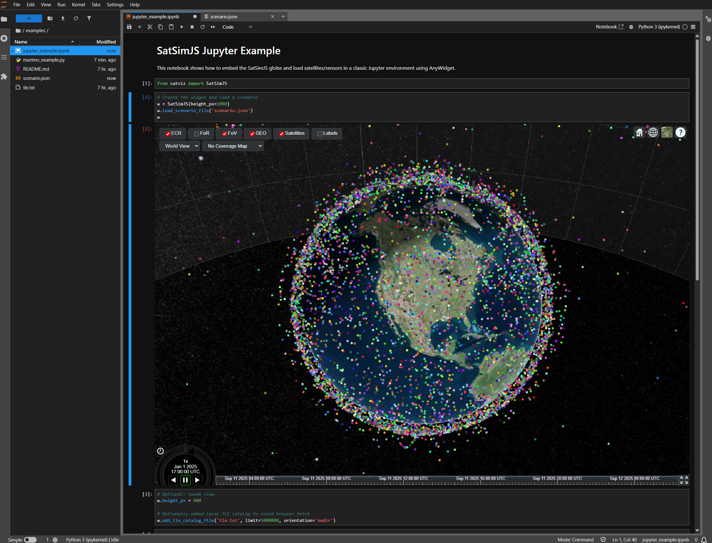

# SatViz

SatSim source code was developed under contract with AFRL/RDSM, and is approved for public release under Public Affairs release approval #AFRL-2022-1116.

The SatSimJS widget for Jupyter and Marimo.



## Installation

```sh
pip install satviz
```

or with [uv](https://github.com/astral-sh/uv):

```sh
uv add satviz
```

## Usage

SatViz loads SatSimJS from `https://cdn.jsdelivr.net/npm/satsim@0.15.0/dist` by default. Override `satsim_base` to point at a mirrored or locally served SatSimJS bundle that contains `satsim.js` and Cesium assets.

Jupyter

```python
from satviz import SatSimJS
w = SatSimJS(height="1000px")
w
```

SatViz is a browser-embedded scenario widget. It does not wrap SatSimJS `SimulationRuntime`; applications that need authoritative sessions, runtime commands, or external control should run that SatSimJS runtime separately.

Marimo

```python
import marimo as mo
from satviz import SatSimJS

widget = SatSimJS(height="900px")
w = mo.ui.anywidget(widget)
w
```

## Example Notebook

From a checkout of this repository, install the development dependencies:

```sh
uv sync --group dev
```

The example notebook reads `SATSIM_BASE` from the environment and defaults to `http://127.0.0.1:8080/dist` for local development.

For local SatSimJS development, serve the SatSimJS repository root in a separate terminal:

```sh
cd $SATSIMJS_PATH
npm run build:cdn
npm run serve
```

Then open the notebook:

```sh
SATSIM_BASE=http://127.0.0.1:8080/dist uv run --group dev env PATH="$PWD/.venv/bin" jupyter lab examples/satviz_example.ipynb
```

### Configuring fullscreen rectangle

Reserve space for headers/footers by customizing the overlay fullscreen rectangle from Python. Values can be numbers (pixels) or CSS strings.

```python
from satviz import SatSimJS

w = SatSimJS(
    height="600px",                      # height when not fullscreen
    fullscreen_rect={
        "top": 64,                       # e.g., top banner height
        "left": 0,
        "width": "100vw",                # or e.g., "100vw"
        "height": "calc(100vh - 96px)",  # subtract top+bottom banners
        "zIndex": 10000,                 # optional overlay stacking order
    },
)
w
```

## Release

To build and publish a release to PyPI:

1. Confirm `satsim@0.15.0` has been published to npm/jsDelivr.
2. Bump `version` in `pyproject.toml`.
3. Build and validate locally:

   ```sh
   uv pip install --upgrade build twine
   uv run python -m build
   uv run twine check dist/*
   ```

4. Publish:

   - Manual: `twine upload dist/*` (requires a `__token__` PyPI API token)
